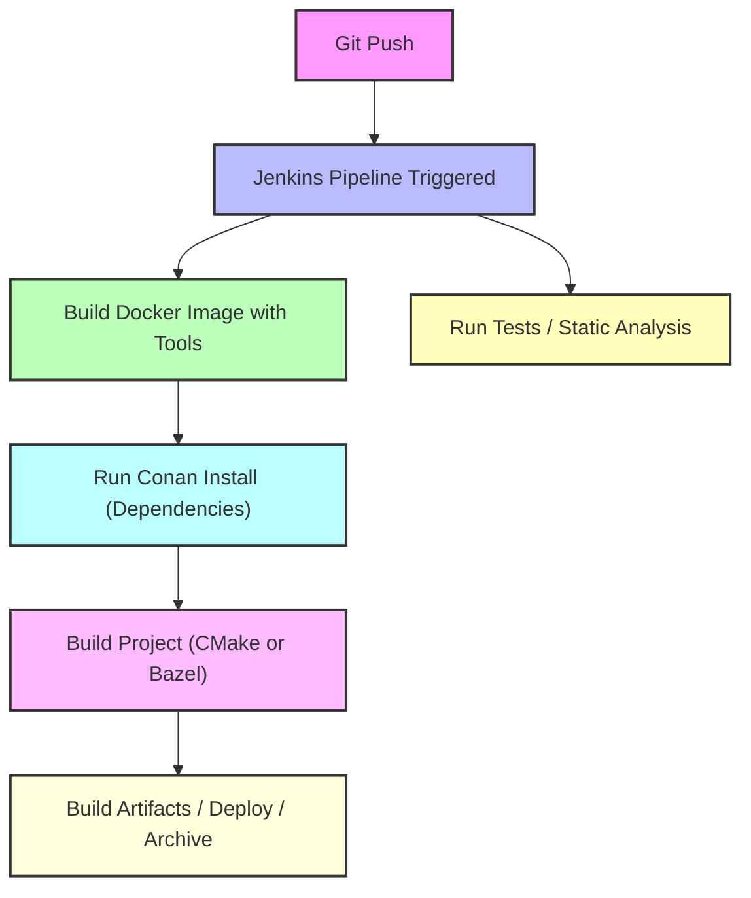

# README – Docker, Conan, Bazel, and Reproducible C++ Builds

## Table of Contents

1. [Introduction](#introduction)
2. [What is Docker?](#what-is-docker)
3. [How Docker Works for C++](#how-docker-works-for-c)
4. [Where Docker Gets C++ Libraries](#where-docker-gets-c-libraries)
5. [Why Docker Alone is Not Enough](#why-docker-alone-is-not-enough)
6. [What is Conan and Why Use It?](#what-is-conan-and-why-use-it)
7. [Conan Internal Process](#conan-internal-process)
8. [Docker + Conan Together](#docker--conan-together)
9. [What is Bazel and Why Use It?](#what-is-bazel-and-why-use-it)
10. [Using Bazel Instead of CMake](#using-bazel-instead-of-cmake)
11. [Alternatives Without Conan](#alternatives-without-conan)
12. [Best Practices](#best-practices)
13. [What is Jenkins?](#what-is-jenkins)
14. [Workflow Diagram – Docker + Conan + Bazel + Jenkins](#workflow-diagram--docker--conan--bazel--jenkins)
15. [Conclusion](#conclusion)
16. [Project](#project)

---

## Introduction

This README explains the purpose and functionality of **Docker**, **Conan**, and **Bazel**, and how they relate to building **modern C++ projects**.

It answers questions like:

* Why Docker alone is insufficient for professional builds
* How Conan automates dependency management and ensures reproducibility
* How Bazel provides a fast, deterministic, and cache-friendly build system
* How these tools integrate in **CI/CD pipelines** like Jenkins

By the end, you’ll understand how to create **fully reproducible C++ builds** in a Dockerized environment using CMake or Bazel.

---

## What is Docker?

**Docker** is a platform for creating, running, and managing **containers**—lightweight, isolated Linux environments.

**Key features:**

* **Isolation:** Containers run independently of the host system
* **Portability:** Runs the same on any machine
* **Reproducibility:** Guarantees consistent OS, compiler, and environment across developers and CI/CD

**Analogy:**

> Docker = Your **kitchen** (oven, utensils, temperature)
> Ensures every chef works in the same kitchen

---

## How Docker Works for C++

1. **Choose a base image** (e.g., `ubuntu:22.04`)
2. **Install build tools** inside the container:

```dockerfile
FROM ubuntu:22.04
RUN apt update && apt install -y \
    g++ cmake make ninja-build pkg-config python3 python3-pip
```

3. **Copy your project** into the container:

```dockerfile
COPY . /app
WORKDIR /app
```

4. **Build your project:**

```bash
cmake -B build -S .
cmake --build build
```

Docker provides:

* Compiler (`g++`, `gcc`)
* Standard libraries (`libstdc++`)
* System libraries (`glibc`, `libm`, `libpthread`)

✅ Simple programs compile successfully without third-party package managers.

---

## Where Docker Gets C++ Libraries

Docker base images only include **system libraries**. Third-party libraries like `fmt`, `spdlog`, `Boost`, or `OpenCV` must be installed manually:

```dockerfile
RUN apt install -y libfmt-dev libspdlog-dev libboost-dev
```

**Limitations:**

* Versions are fixed by OS repositories
* Manual installation is error-prone
* Transitive dependencies aren’t automatically resolved

---

## Why Docker Alone is Not Enough

Docker ensures **environment consistency**, but cannot automatically manage third-party libraries.

Example:

```cpp
#include <fmt/core.h>
```

Error without installation:

```
fatal error: fmt/core.h: No such file or directory
```

Docker alone cannot:

* Fetch library versions automatically
* Handle transitive dependencies
* Ensure binaries match compiler flags or ABI

---

## What is Conan and Why Use It?

[Conan](https://github.com/conan-io/conan) is a **C/C++ package manager** that automates:

1. Fetching and building libraries (`fmt`, `spdlog`)
2. Handling **transitive dependencies**
3. Version and ABI management
4. Integration with **CMake**, **Bazel**, or other build systems

Conan ensures **reproducible builds** and eliminates manual library management.

### Example `conanfile.txt`

```ini
[requires]
fmt/10.1.1
spdlog/1.12.0

[generators]
CMakeDeps
CMakeToolchain
```

* `[requires]` → declares dependencies
* `[generators]` → integrates libraries with CMake/Bazel

  * `CMakeDeps` → generates `<pkg>-config.cmake` files
  * `CMakeToolchain` → generates `conan_toolchain.cmake`

---

## Conan Internal Process

1. Reads **recipe and profile** (compiler, OS, architecture)
2. Resolves the **dependency graph**
3. Checks **local cache** for binaries
4. Downloads missing recipes/binaries from remotes
5. Builds binaries if not found, respecting **compiler flags and ABI**
6. Generates integration files (`conan_toolchain.cmake`, `<pkg>-config.cmake`)
7. Builds project with correct dependencies
8. Caches binaries for future builds

---

## Docker + Conan Together

Using Docker and Conan together ensures **full reproducibility**:

```
Docker container (Ubuntu 22.04)
 ├─ g++, cmake, python3, conan installed
 └─ conan install → pulls fmt, spdlog, etc.
     └─ cmake build → compiles project with correct flags and dependencies
```

> Docker = Kitchen
> Conan = Ingredients (exact sugar, flour, butter)
> Together → Perfect, reproducible cake 🍰

---

## What is Bazel and Why Use It?

**Bazel** is a **fast, reliable, and reproducible build system** created by Google.

Unlike Make or CMake, Bazel emphasizes:

* **Deterministic outputs** – same inputs produce same outputs
* **Incremental builds** – rebuilds only changed parts
* **Scalability** – handles large, multi-language projects
* **Remote caching & execution** – shares artifacts across machines

### Why Bazel Over CMake?

| Feature                    | Bazel                                        | CMake                                      |
| -------------------------- | -------------------------------------------- | ------------------------------------------ |
| **Incremental builds**     | ✅ Fast, minimal rebuilds                     | ⚠️ May rebuild more than necessary         |
| **Deterministic builds**   | ✅ Fully reproducible outputs                 | ⚠️ Depends on environment and generator    |
| **Remote caching**         | ✅ Built-in support                           | ⚠️ Requires external tools                 |
| **Dependency tracking**    | ✅ File-level, precise                        | ⚠️ Target-level, may rebuild unnecessarily |
| **Scalability**            | ✅ Large projects                             | ⚠️ Slower for very large projects          |
| **Multi-language support** | ✅ C++, Java, Python, Go                      | ⚠️ Needs separate tools                    |
| **CI/CD integration**      | ✅ Optimized for caching & distributed builds | ⚠️ Less seamless                           |

**Analogy:**

> CMake = Recipe book
> Bazel = Master chef + automated kitchen

**When to Prefer Bazel:**

* Large-scale projects
* Fast, reproducible CI/CD builds
* Multiple languages or embedded platforms

---

## Using Bazel Instead of CMake

Bazel can build **C++ projects with or without Conan**.

### Example BUILD file

```python
load("@rules_cc//cc:defs.bzl", "cc_library", "cc_binary")

cc_library(
    name = "log_lib",
    srcs = ["ConsoleSinkImpl.cpp", "FileSinkImpl.cpp", "LogManager.cpp", "LogMessage.cpp"],
    hdrs = glob(["../inc/*.hpp"]),
    includes = ["../inc"],
    deps = [],
    visibility = ["//visibility:public"],
)

cc_binary(
    name = "main",
    srcs = ["main.cpp"],
    deps = [":log_lib"],
)
```

### Build and Run

```bash
bazel build //src:main
./bazel-bin/src/main
```

Bazel can optionally integrate with Conan for dependency resolution using custom `conan_bzl.rc` or toolchain files.

---

## Alternatives Without Conan

1. **OS packages (`apt`, `brew`)** – limited versions
2. **Manual build** – slow, error-prone
3. **CMake FetchContent / ExternalProject_Add** – suitable for small projects

Conan simplifies all steps, ensuring **reproducibility and automation**.

---

## Best Practices

* Use **Docker** for OS + compiler + tools
* Use **Conan** for libraries
* Use **Bazel** or **CMake** as the build system
* Cache dependencies locally or in CI/CD pipelines
* Combine Docker + Conan + Bazel/CMake for **professional, reproducible builds**

---

## What is Jenkins?

**Jenkins** is an open-source **automation server** for **CI/CD**.

* Automates builds, tests, deployments
* Supports pipelines for complex workflows
* Integrates seamlessly with Docker, Conan, and Bazel/CMake

Workflow:

```
Git Push → Jenkins Pipeline Triggered
 ├─ Checkout Code
 ├─ Build Docker Image with Tools
 ├─ Run Conan Install
 ├─ Build Project (CMake or Bazel)
 ├─ Run Tests
 └─ Deploy or Archive Artifacts
```

> Jenkins = Project Manager
> Docker = Kitchen
> Conan = Ingredients
> Bazel/CMake = Cooking process

---

## Workflow Diagram – Docker + Conan + Bazel + Jenkins



---

## Conclusion

* Docker = OS + compiler + tools
* Conan = library dependencies + reproducibility
* Bazel = fast, deterministic builds with caching
* Jenkins = CI/CD orchestrator

**TL;DR:**

> Together → **reproducible, reliable, professional C++ builds**

---

## Project

The [QuantumLog](https://github.com/YoussefMostafaMohammed/QuantumLog) project demonstrates:

* Real-world C++ project structure
* Integration with **CMake** or **Bazel**
* **Conan** for dependencies (`fmt`, `spdlog`)
* Dockerized build environment
* CI/CD readiness with Jenkins

**Getting Started:**

```bash
git clone https://github.com/YoussefMostafaMohammed/QuantumLog.git
cd QuantumLog

# Build with Bazel (optional Conan)
docker build --build-arg BUILD_SYSTEM=bazel --build-arg USE_CONAN=false -t quantumlog-bazel .
docker run --rm quantumlog-bazel
```
