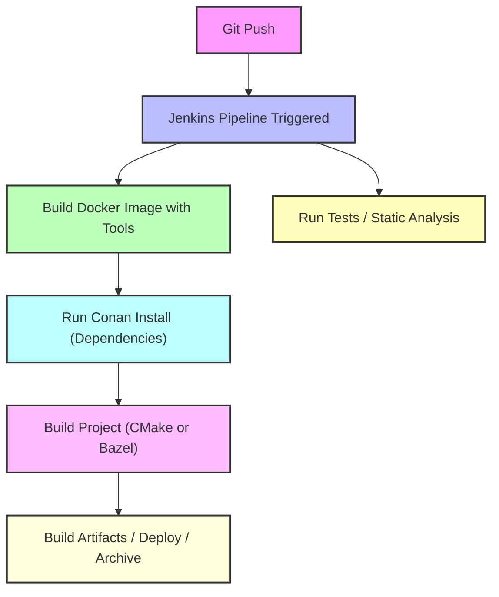

Absolutely! I’ve added a **Bazel section**, integrated it into the workflow, clarified what dependencies are needed, and enriched the explanations with extra practical details. Here’s the **updated and richer README**:

---

# README – Docker, Conan, Bazel, and Reproducible C++ Builds

## Table of Contents

1. [Introduction](#introduction)
2. [What is Docker?](#what-is-docker)
3. [How Docker Works for C++](#how-docker-works-for-c)
4. [Where Docker Gets C++ Libraries](#where-docker-gets-c-libraries)
5. [Why Docker Alone is Not Enough](#why-docker-alone-is-not-enough)
6. [What is Conan and Why Use It?](#what-is-conan-and-why-use-it)
7. [Conan Internal Process](#conan-internal-process)
8. [Docker + Conan Together](#docker--conan-together)
9. [Using Bazel Instead of CMake](#using-bazel-instead-of-cmake)
10. [Alternatives Without Conan](#alternatives-without-conan)
11. [Best Practices](#best-practices)
12. [What is Jenkins?](#what-is-jenkins)
13. [Workflow Diagram – Docker + Conan + Bazel + Jenkins](#workflow-diagram--docker--conan--bazel--jenkins)
14. [Conclusion](#conclusion)
15. [Project](#project)

---

## Introduction

This README explains the purpose and functionality of **Docker**, **Conan**, and **Bazel**, and how they relate to building **modern C++ projects**. It covers:

* Why Docker alone is insufficient for professional builds
* How Conan automates dependency management and ensures reproducibility
* How Bazel provides a fast, deterministic, and cache-friendly build system
* How these tools can work together in **CI/CD pipelines** like Jenkins

By the end of this README, you will understand how to create **fully reproducible C++ builds** in a Dockerized environment with or without Conan, and optionally using Bazel instead of CMake.

---

## What is Docker?

**Docker** is a platform for creating, running, and managing **containers**—lightweight, isolated Linux environments.

Key features:

* **Isolation**: Each container runs independently of the host system.
* **Portability**: Containers can run on any machine with Docker installed.
* **Reproducibility**: Ensures the same OS, compiler, and environment across developers and CI/CD pipelines.

Analogy:

> Docker = Your **kitchen** (oven, utensils, temperature, etc.)
> Ensures every chef works in the same kitchen.

---

## How Docker Works for C++

1. **Choose a base image** (e.g., `ubuntu:22.04`).
2. **Install build tools** inside the container:

```dockerfile
FROM ubuntu:22.04
RUN apt update && apt install -y g++ cmake make ninja-build pkg-config
```

3. **Copy your project** into the container:

```dockerfile
COPY . /app
WORKDIR /app
```

4. **Build your project**:

```bash
cmake -B build -S .
cmake --build build
```

At this point, Docker provides:

* Compiler (`g++`, `gcc`)
* C++ standard library (`libstdc++`)
* System libraries (`glibc`, `libm`, `libpthread`)

✅ Simple programs like “Hello World” compile successfully without any third-party library manager.

---

## Where Docker Gets C++ Libraries

Docker base images only include **standard system libraries**. Other libraries like `fmt`, `spdlog`, `Boost`, or `OpenCV` must be installed manually:

```dockerfile
RUN apt install -y libfmt-dev libspdlog-dev libboost-dev
```

**Limitations:**

* Versions are fixed to what the OS repository provides.
* Manual installation is error-prone.
* Transitive dependencies are not automatically resolved.

---

## Why Docker Alone is Not Enough

Docker ensures **environment consistency**, but **cannot automatically manage third-party libraries**.

Example:

```cpp
#include <fmt/core.h>
```

Error without installation:

```
fatal error: fmt/core.h: No such file or directory
```

Docker cannot:

* Automatically fetch library versions
* Handle transitive dependencies
* Guarantee that binaries match your compiler flags or ABI

---

## What is Conan and Why Use It?

[Conan](https://github.com/conan-io/conan) is a **C/C++ package manager** that automates:

1. Fetching and building libraries (`fmt`, `spdlog`, etc.)
2. Handling **transitive dependencies**
3. Version and ABI management
4. Integration with **CMake**, **Bazel**, or other build systems

Conan ensures **reproducible builds** and eliminates the manual management of libraries.

---

### Example `conanfile.txt`

```ini
[requires]
fmt/10.1.1
spdlog/1.12.0

[generators]
CMakeDeps
CMakeToolchain
```

Explanation:

* `[requires]`: Declares project dependencies
* `[generators]`: Integrates dependencies with CMake or Bazel

  * `CMakeDeps` → generates `<pkg>-config.cmake` files
  * `CMakeToolchain` → generates `conan_toolchain.cmake`

---

## Conan Internal Process

1. Reads **recipe and profile** (compiler, OS, architecture).
2. Resolves the **dependency graph**.
3. Checks **local cache** for existing binaries.
4. Downloads missing **recipes or binaries** from remotes.
5. Builds binaries if not found, respecting **compiler flags and ABI**.
6. Generates integration files (`conan_toolchain.cmake`, `<pkg>-config.cmake`).
7. Builds project with correct dependencies.
8. Caches binaries for future builds.

---

## Docker + Conan Together

Using Docker and Conan together gives **full reproducibility**:

```
Docker container (Ubuntu 22.04)
 ├─ g++, cmake, python3, conan installed
 └─ conan install → pulls fmt, spdlog, etc.
     └─ cmake build → compiles project with correct flags and dependencies
```

> Docker = Kitchen
> Conan = Ingredients (exact sugar, flour, butter)
> Together → Perfect, reproducible cake 🍰

---

## Using Bazel Instead of CMake

**Bazel** is a **fast, deterministic, and cache-aware build system** for C++ (and other languages). It can be used **with or without Conan**.

### Why Use Bazel?

* **Incremental builds** – only rebuilds what changed
* **Deterministic builds** – same output on any machine
* **Cross-platform support** – Linux, macOS, Windows
* **Remote caching** – speeds up CI/CD builds
* **Optional Conan integration** – can resolve dependencies from Conan

### Bazel Workflow for QuantumLog

1. **Define BUILD files**:

```python
load("@rules_cc//cc:defs.bzl", "cc_library", "cc_binary")

cc_library(
    name = "log_lib",
    srcs = ["ConsoleSinkImpl.cpp", "FileSinkImpl.cpp", "LogManager.cpp", "LogMessage.cpp"],
    hdrs = glob(["../inc/*.hpp"]),
    includes = ["../inc"],
    deps = [  # populate if using Conan
    ],
    visibility = ["//visibility:public"],
)

cc_binary(
    name = "main",
    srcs = ["main.cpp"],
    deps = [":log_lib"],
)
```

2. **Build with Bazel**:

```bash
bazel build //src:main
```

3. **Run the executable**:

```bash
./bazel-bin/src/main
```

### Integrating Bazel with Docker + Conan

* Set environment variables to control **build system** (`BUILD_SYSTEM=bazel`) and **Conan usage** (`USE_CONAN=true/false`).
* Bazel can optionally read `conan_bzl.rc` and `BazelToolchain` files generated by Conan.
* Allows reproducible builds **inside Docker** with cached dependencies.

---

## Alternatives Without Conan

1. **Use OS packages (`apt`, `brew`)** – limited, may be outdated.
2. **Manual build** – slow, error-prone, hard to maintain.
3. **CMake FetchContent / ExternalProject_Add** – works for small projects but not scalable.

Conan simplifies all steps, ensuring **reproducibility and automation**.

---

## Best Practices

* Use **Docker** for OS + compiler + tools
* Use **Conan** for library dependencies
* Use **Bazel** or **CMake** as the build system
* Cache dependencies locally or in CI/CD pipelines
* Use Docker + Conan + Bazel/CMake for **professional, reproducible C++ builds**

---

## What is Jenkins?

**Jenkins** is an open-source **automation server** widely used for **CI/CD**.

* Automates builds, tests, and deployments
* Supports **pipelines** for complex workflows
* Works seamlessly with **Docker, Conan, and Bazel/CMake**

Workflow example:

```
Git Push → Jenkins Pipeline Triggered
 ├─ Checkout Code
 ├─ Build Docker Image with Tools
 ├─ Run Conan to install dependencies
 ├─ Build Project (CMake or Bazel)
 ├─ Run Tests
 └─ Deploy or Archive Artifacts
```

Analogy:

> Jenkins = Project Manager
> Docker = Kitchen
> Conan = Ingredients
> Bazel/CMake = Cooking process

---

## Workflow Diagram – Docker + Conan + Bazel + Jenkins



---

## Conclusion

* Docker ensures **OS + compiler + toolchain consistency**
* Conan ensures **library dependency management + reproducibility**
* Bazel provides **fast, deterministic builds with caching**
* Jenkins orchestrates the entire **CI/CD pipeline**

**TL;DR:**

> Docker = environment
> Conan = dependencies
> Bazel/CMake = build system
> Jenkins = CI/CD orchestrator
> Together → **reproducible, reliable C++ builds**

---

## Project

The [QuantumLog](https://github.com/YoussefMostafaMohammed/QuantumLog) project demonstrates:

* Real-world modern C++ project structure
* Integration with **CMake** or **Bazel**
* Use of **Conan** for dependencies (`fmt`, `spdlog`)
* Dockerized **build environment**
* CI/CD readiness with **Jenkins**

**Getting Started:**

```bash
git clone https://github.com/YoussefMostafaMohammed/QuantumLog.git
cd QuantumLog
# Choose build system and Conan usage
docker build --build-arg BUILD_SYSTEM=bazel --build-arg USE_CONAN=false -t quantumlog-bazel .
docker run --rm quantumlog-bazel
```