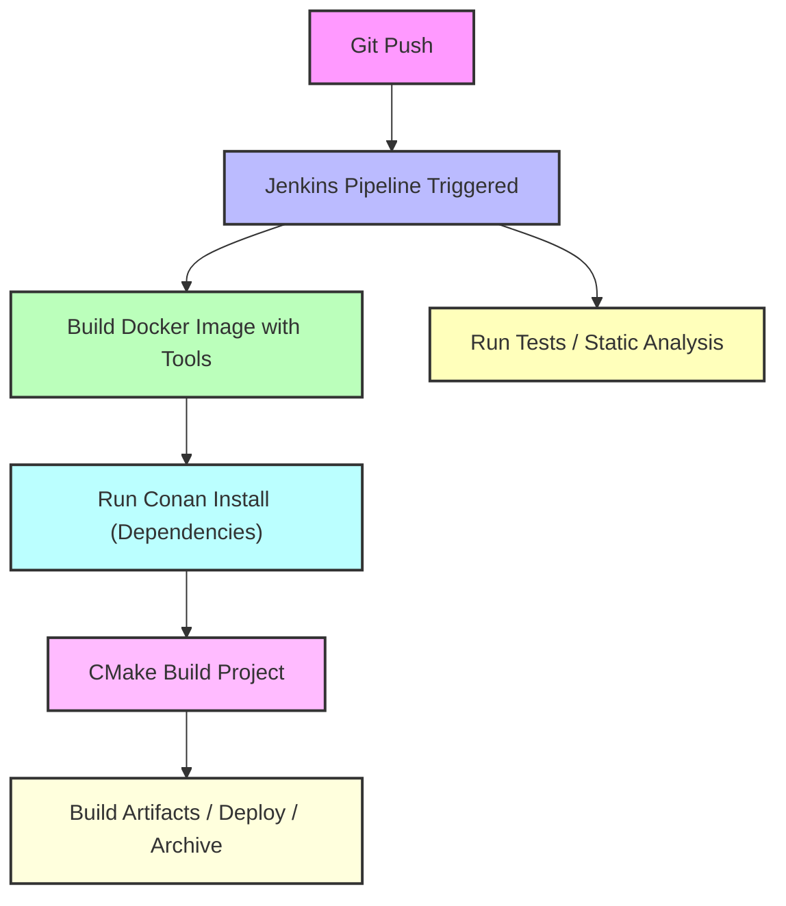

# README – Docker, Conan, and Reproducible C++ Builds

## Table of Contents

1. [Introduction](#introduction)
2. [What is Docker?](#what-is-docker)
3. [How Docker Works for C++](#how-docker-works-for-c)
4. [Where Docker Gets C++ Libraries](#where-docker-gets-c-libraries)
5. [Why Docker Alone is Not Enough](#why-docker-alone-is-not-enough)
6. [What is Conan and Why Use It?](#what-is-conan-and-why-use-it)
7. [Conan Internal Process](#conan-internal-process)
8. [Docker + Conan Together](#docker--conan-together)
9. [Alternatives Without Conan](#alternatives-without-conan)
10. [Best Practices](#best-practices)
11. [What is Jenkins?](#what-is-jenkins)
12. [Workflow Diagram – Docker + Conan + Jenkins](#workflow-diagram--docker--conan--jenkins)
13. [Conclusion](#conclusion)
14. [Project](#project)

---

## Introduction

This README explains the purpose and functionality of **Docker** and **Conan**, how they relate to building C++ projects, and why they are often used together.

It answers common questions:

* Is Docker enough for C++ builds?
* Where do Docker builds get their libraries?
* What does Conan do internally?
* Can I use Docker and Conan together?
* Are there alternatives to Conan?

It also explains **technical concepts step-by-step** and provides practical examples.

---

## What is Docker?

**Docker** is a platform for creating, running, and managing **containers**.

A container is like a **lightweight, isolated Linux environment** packaged with everything your application needs.

Key features:

* **Isolation**: Runs your app without interfering with your host OS.
* **Portability**: Same container runs on any machine.
* **Reproducibility**: Ensures the same OS, compiler, and environment across developers and CI/CD pipelines.

Analogy:

> Docker = Your **kitchen** (oven, utensils, temperature, etc.).
> Ensures every chef works in the same kitchen.

---

## How Docker Works for C++

1. **Choose a base image** (e.g., Ubuntu 22.04).
2. **Install development tools** inside the container:

```dockerfile
FROM ubuntu:22.04
RUN apt update && apt install -y g++ cmake make
```

3. **Copy your project** into the container:

```dockerfile
COPY . /app
WORKDIR /app
```

4. **Build your project**:

```bash
cmake .
make
```

At this point, Docker provides:

* Compiler (`g++`, `gcc`)
* C++ standard library (`libstdc++`)
* System libraries (`glibc`, `libm`, `libpthread`)

✅ That’s why simple “Hello World” programs compile without Conan.

---

## Where Docker Gets C++ Libraries

Docker base images do **not include third-party libraries**.

* **Standard libraries** come with the compiler in the base image.
* **Other libraries** (fmt, boost, OpenCV) must be installed manually:

```dockerfile
RUN apt install -y libfmt-dev libboost-dev
```

**Limitations**:

* Versions are fixed to what the OS repository provides (may be outdated).
* Manual installation is error-prone.
* Transitive dependencies are not automatically handled.

---

## Why Docker Alone is Not Enough

Docker ensures a consistent **environment and compiler**, but it does **not automatically manage external C++ libraries**.

For example, the following code will fail in a plain Docker container without additional setup:

```cpp
#include <fmt/core.h>
```

Error:

```
fatal error: fmt/core.h: No such file or directory
```

Reasons Docker alone isn’t enough:

* Cannot automatically fetch or resolve library versions.
* Cannot handle transitive dependencies.
* Cannot ensure library binaries match your compiler flags or ABI.

---

## What is Conan and Why Use It?

[Conan](https://github.com/conan-io/conan) is a **C/C++ package manager**.

It automates:

1. Downloading libraries (e.g., `fmt`, `boost`)
2. Building them if binaries are not available for your compiler/OS
3. Managing versions and transitive dependencies
4. Integrating libraries into CMake or other build systems

Conan ensures **reproducible C++ builds** across machines and environments.

---

### Example `conanfile.txt`

```ini
[requires]
fmt/10.1.1

[generators]
CMakeDeps
CMakeToolchain
```

Explanation:

* `[requires]`: declares your project dependencies
* `[generators]`: tells Conan how to integrate with CMake
* `CMakeDeps` → generates `fmt-config.cmake` so CMake can find and link the library.
* `CMakeToolchain` → generates `conan_toolchain.cmake`, specifying compiler, flags, sysroot, and build settings for reproducibility.

---

## Conan Internal Process – Step by Step

1. **Read recipe** (`conanfile.txt` or `conanfile.py`) and profile (compiler, OS, arch).
2. **Resolve dependency graph** (including transitive dependencies).
3. **Check local cache** for recipes and binaries.
4. **Download recipes or binaries** from remotes if missing.
5. **Build binaries** if necessary (with correct compiler, flags, and ABI).
6. **Generate integration files** (`conan_toolchain.cmake` and `<pkg>-config.cmake`).
7. **CMake configuration** uses the toolchain and dependency files.
8. **Build stage** links your code against Conan-provided binaries.
9. **Cache and reuse** binaries to speed up future builds or CI/CD.

---

### Toolchain File Example

`conan_toolchain.cmake` may contain:

* `CMAKE_C_COMPILER` and `CMAKE_CXX_COMPILER`
* Compiler flags (`CMAKE_C_FLAGS`, `CMAKE_CXX_FLAGS`)
* Sysroot and architecture settings (`CMAKE_SYSROOT`)
* Paths to Conan dependencies (`CMAKE_PREFIX_PATH`)
* Imported targets and macros for CMake

---

## Docker + Conan Together

Using Docker and Conan together provides **full reproducibility**:

* Docker → ensures the OS and compiler are consistent
* Conan → ensures library versions and ABI compatibility

Workflow:

```
Docker container (Ubuntu 22.04)
 ├─ g++, cmake, python3, conan installed
 └─ conan install → pulls fmt, boost, etc.
     └─ cmake build → compiles project with correct flags and dependencies
```

Analogy:

> Docker = Kitchen
> Conan = Ingredients (exact sugar, flour, butter)
> Together → Perfect, reproducible cake 🍰

---

## Alternatives Without Conan

1. **Use apt / brew packages**

   * Quick but limited versions, may be outdated.

2. **Manual build**

   * Clone/build each library yourself. Slow and error-prone.

3. **CMake FetchContent / ExternalProject_Add**

   * Works for small projects but not scalable.

Conan simplifies all these steps and ensures **consistency, reproducibility, and automation**.

---

## Best Practices

* Use **Docker for OS + compiler + tools**.
* Use **Conan for library dependencies**.
* Use **CMakeToolchain and CMakeDeps generators** to automatically integrate dependencies.
* Use **profiles** in Conan to control compiler, architecture, and build type.
* Cache Conan binaries locally or in CI/CD for faster builds.
* Use Docker + Conan together in **professional, cross-platform, or embedded C++ projects**.

---

## What is Jenkins?

**Jenkins** is an open-source **automation server** widely used for **Continuous Integration (CI)** and **Continuous Deployment (CD)** in software projects. It helps automate repetitive tasks like building, testing, and deploying applications.

Key features:

* **Automation**: Automatically runs builds, tests, and deployments whenever code changes.
* **Pipeline Support**: Define complex workflows with Jenkins pipelines (via Groovy scripts or declarative pipelines).
* **Extensibility**: Large ecosystem of plugins for version control (Git), build tools (CMake, Maven, Gradle), testing, notifications, and more.
* **Cross-platform**: Can run on Linux, Windows, macOS, or inside Docker containers.
* **Integration**: Works seamlessly with tools like Docker and Conan for reproducible builds.

### How Jenkins Fits with Docker and Conan

* **Docker**: Jenkins can run builds inside Docker containers, ensuring a **consistent build environment** for all developers and CI servers.
* **Conan**: Jenkins pipelines can automate **dependency installation and building** using Conan, ensuring **reproducible C++ builds**.

### Example Workflow with Jenkins, Docker, and Conan

```
Git Push → Jenkins Pipeline Triggered
 ├─ Checkout Code
 ├─ Build Docker Image with required tools
 ├─ Run Conan to install dependencies
 ├─ Run CMake to build the project
 ├─ Run Tests
 └─ Deploy or Archive Artifacts
```

Analogy:

> Jenkins = **Project manager**
> Docker = **Kitchen**
> Conan = **Ingredients**
> Together → The manager ensures the kitchen and ingredients are used correctly every time to produce the same perfect result.

---

## Workflow Diagram – Docker + Conan + Jenkins



---

## Conclusion

* Docker and Conan solve **different layers** of reproducibility.
* Docker = OS + compiler + toolchain
* Conan = C++ dependencies + versions + integration
* Using both together ensures **fully reproducible builds** across developers, CI/CD, and production environments.

**TL;DR:**

> Docker ensures environment consistency, Conan ensures dependency consistency. Together, they provide **professional, reliable C++ builds**.

---

## Project

As a practical example of using **Docker**, **Conan**, **Jenkins**, and **modern C++**, this repository uses the [QuantumLog](https://github.com/YoussefMostafaMohammed/QuantumLog) project.

QuantumLog demonstrates:

* A real-world modern C++ project structure
* Integration with **CMake** for building
* Use of **Conan** for managing dependencies like `fmt` and other libraries
* Building inside **Docker** for a reproducible environment
* Compatibility with **Jenkins CI/CD** pipelines for automated builds and tests

This example shows how to combine **modern C++ development**, **reproducible builds**, and **dependency management** in a professional workflow.

**Getting started with QuantumLog in this setup:**

1. Clone the repository:

```bash
git clone https://github.com/YoussefMostafaMohammed/QuantumLog.git
cd QuantumLog
```

> Then follow the steps in the notes directory.