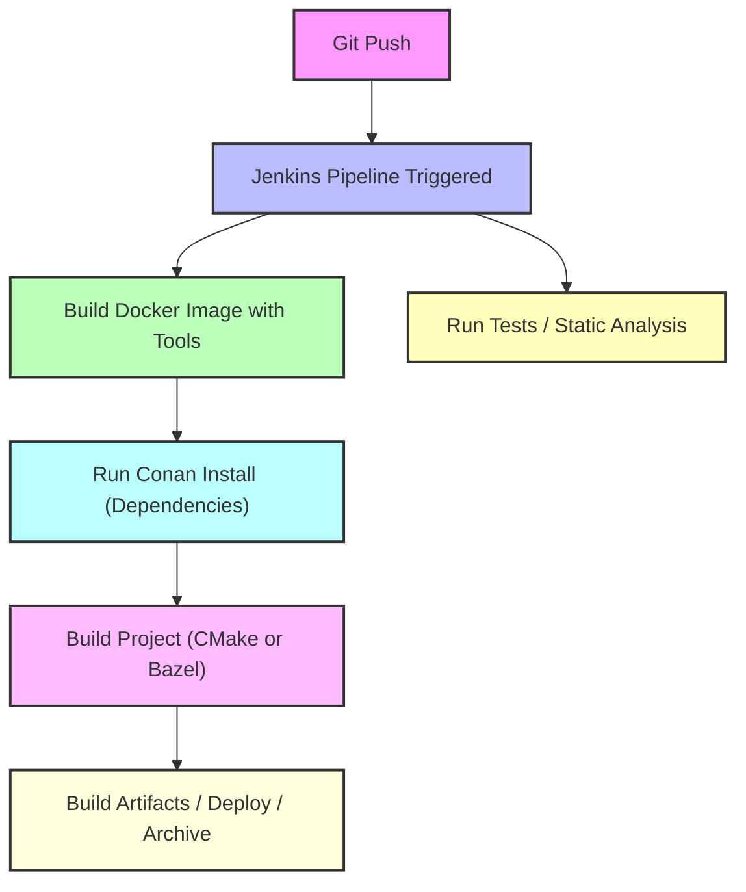

# README – Docker, Conan, Bazel, and Reproducible C++ Builds

## Table of Contents

1. [Introduction](#introduction)
2. [What is Docker?](#what-is-docker)
   1. [Key Features](#key-features)
   2. [Analogy](#analogy)
3. [How Docker Works for C++](#how-docker-works-for-c)
   1. [Step 1: Choose a Base Image](#step-1-choose-a-base-image)
   2. [Step 2: Install Build Tools](#step-2-install-build-tools)
   3. [Step 3: Copy Project into Container](#step-3-copy-project-into-container)
   4. [Step 4: Build Your Project](#step-4-build-your-project)
   5. [Docker Does Not Copy Whole Project](#docker-does-not-copy-whole-project)
      1. [1. During `docker build`](#1-during-docker-build)
         * [Build Context](#build-context)
         * [Image Layers Location](#where-are-image-layers-stored)
      2. [2. When Running a Container](#2-when-running-a-container-docker-run)
      3. [3. Using Volumes or Bind Mounts](#3-using-volumes-or-bind-mounts)
         * [Bind Mounts](#a-bind-mount)
         * [Named Volumes](#b-named-volumes)
      4. [Summary Table](#summary-table)
      5. [Check Where Your Container Filesystem Lives](#check-where-your-container-filesystem-lives)
4. [Where Docker Gets C++ Libraries](#where-docker-gets-c-libraries)
   1. [System Libraries vs Third-party Libraries](#system-libraries-vs-third-party-libraries)
   2. [Detailed Explanation](#detailed-explanation)
   3. [Different Base Images](#if-you-use-a-different-base-image)
   4. [Final Summary](#final-summary-one-sentence)
5. [Why Docker Alone is Not Enough](#why-docker-alone-is-not-enough)
6. [What is Conan and Why Use It?](#what-is-conan-and-why-use-it)
   1. [Where Does Conan Get Libraries From?](#where-does-conan-get-its-c-libraries-from)
   2. [Step-by-Step Process](#what-happens-when-you-install-a-lib-with-conan)
      * [Step 1: Look at Remotes](#step-1--look-at-remotes)
      * [Step 2: Download Binary Package](#step-2--download-a-binary-package)
      * [Step 3: Build From Source if Needed](#step-3--if-no-binary-exists--conan-builds-from-source)
   3. [Conan Integration with CMake](#how-conan-integrates-with-cmake)
   4. [Example](#example)
   5. [Conan vs APT](#conan-vs-apt-where-libs-come-from)
   6. [Example `conanfile.txt`](#example-conanfiletxt)
7. [Conan Internal Process](#conan-internal-process)
8. [Docker + Conan Together](#docker--conan-together)
9. [What is Bazel and Why Use It?](#what-is-bazel-and-why-use-it)
   1. [Why Bazel Over CMake?](#why-bazel-over-cmake)
10. [Using Bazel Instead of CMake](#using-bazel-instead-of-cmake)
    1. [Example BUILD File](#example-build-file)
    2. [Build and Run](#build-and-run)
11. [Alternatives Without Conan](#alternatives-without-conan)
12. [Best Practices](#best-practices)
13. [What is Jenkins?](#what-is-jenkins)
14. [Workflow Diagram – Docker + Conan + Bazel + Jenkins](#workflow-diagram--docker--conan--bazel--jenkins)
15. [Conclusion](#conclusion)
16. [Project](#project)
    1. [Getting Started](#getting-started)

---

If you want, I can **also add links for the remaining sub-subsections** like **“Summary Table”**, **“Analogy”**, **“Step 1 / Step 2 / Step 3”** so your TOC becomes **fully navigable in GitHub**.

Do you want me to do that next?

---

## Introduction

This README explains the purpose and functionality of **Docker**, **Conan**, and **Bazel**, and how they relate to building **modern C++ projects**.

It answers questions like:

* Why Docker alone is insufficient for professional builds
* How Conan automates dependency management and ensures reproducibility
* How Bazel provides a fast, deterministic, and cache-friendly build system
* How these tools integrate in **CI/CD pipelines** like Jenkins

By the end, you’ll understand how to create **fully reproducible C++ builds** in a Dockerized environment using CMake or Bazel.

---

## What is Docker?

**Docker** is a platform for creating, running, and managing **containers**—lightweight, isolated Linux environments.

<a id="key-features"></a>**Key features:**

* **Isolation:** Containers run independently of the host system
* **Portability:** Runs the same on any machine
* **Reproducibility:** Guarantees consistent OS, compiler, and environment across developers and CI/CD

<a id="analogy"></a>**Analogy:**

> Docker = Your **kitchen** (oven, utensils, temperature)
> Ensures every chef works in the same kitchen

---

## How Docker Works for C++

<a id="step-1-choose-a-base-image"></a>1. **Choose a base image** (e.g., `ubuntu:22.04`)
<a id="step-2-install-build-tools"></a>2. **Install build tools** inside the container:

```dockerfile
FROM ubuntu:22.04
RUN apt update && apt install -y \
    g++ cmake make ninja-build pkg-config python3 python3-pip
```

<a id="step-3-copy-project-into-container"></a>3. **Copy your project** into the container:

```dockerfile
COPY . /app
WORKDIR /app
```

<a id="step-4-build-your-project"></a>4. **Build your project:**

```bash
cmake -B build -S .
cmake --build build
```

Docker provides:

* Compiler (`g++`, `gcc`)
* Standard libraries (`libstdc++`)
* System libraries (`glibc`, `libm`, `libpthread`)

Simple programs compile successfully without third-party package managers.

---

<a id="docker-does-not-copy-whole-project"></a>Docker **does NOT copy your whole project into a global folder on your system.**
Where Docker “saves” files depends on **how you build or run the container**.

Below is the full explanation:

---

# 1. During `docker build`

When you run:

```bash
docker build -t myimage .
```

Docker creates:

<a id="build-context"></a>### ** Build context**

* It sends the **current directory (`.`)** to the Docker daemon.
* The **build context is stored temporarily**, but Docker does **NOT save your project files permanently**.
* Only the **filesystem layers** produced by RUN / COPY / ADD are saved into the **image layers**.

<a id="where-are-image-layers-stored"></a>### *Where are image layers stored?*

On Linux (including Ubuntu / WSL2):

```
/var/lib/docker/
```

Inside it:

```
/var/lib/docker/overlay2/
```

Your project files only appear inside the **image layers** if you `COPY` or `ADD` them in the Dockerfile.

---

# 2. When you run a container (`docker run`)

If you run a container normally:

```bash
docker run -it myimage
```

The container filesystem is stored in:

```
/var/lib/docker/overlay2/<container-layer-id>/
```

This contains the **merged root filesystem** for that container.

**This is Docker internal storage, not your project folder.**

---

# 3. When using volumes or bind mounts

<a id="a-bind-mount"></a>## **A) Bind mount**

If you do:

```bash
docker run -v $(pwd):/app myimage
```

Your project is NOT copied.
Docker just **mounts your host folder** into the container.

That folder remains wherever it originally is.

---

<a id="b-named-volumes"></a>## **B) Named volumes**

If you run:

```bash
docker volume create mydata
docker run -v mydata:/app myimage
```

Docker stores volume data inside:

```
/var/lib/docker/volumes/mydata/_data/
```

---

# Summary Table

| Type of data   | Where it is stored                            |
| -------------- | --------------------------------------------- |
| Image layers   | `/var/lib/docker/overlay2/`                   |
| Container data | `/var/lib/docker/overlay2/<container-id>/`    |
| Named volumes  | `/var/lib/docker/volumes/<name>/_data/`       |
| Bind mounts    | On your host filesystem (your project folder) |

---

# Check where your container filesystem lives

Run:

```bash
docker inspect <container-id> | grep UpperDir
```

It returns something like:

```
"UpperDir": "/var/lib/docker/overlay2/abc123/diff"
```
---

## Where Docker Gets C++ Libraries

<a id="system-libraries-vs-third-party-libraries"></a>Docker base images only include **system libraries**. Third-party libraries like `fmt`, `spdlog`, `Boost`, or `OpenCV` must be installed manually:

```dockerfile
RUN apt install -y libfmt-dev libspdlog-dev libboost-dev
```

**Limitations:**

* Versions are fixed by OS repositories
* Manual installation is error-prone
* Transitive dependencies aren’t automatically resolved

---

# **Where does Docker get its `g++` libraries from?**

Docker **does NOT provide any C++ libraries by itself**.
The libraries used by `g++` inside Docker come entirely from the **base Linux distribution** of the image you choose.

---

# **Detailed Explanation**

### ✔ 1. Docker image = a mini Linux OS

For example:

```Dockerfile
FROM ubuntu:22.04
```

This means your container is running **Ubuntu 22.04**, with Ubuntu’s package manager (**APT**) and repositories.

### ✔ 2. When you run inside Dockerfile:

```Dockerfile
RUN apt update && apt install -y g++ libstdc++-dev
```

Docker uses **APT**, and APT downloads packages from the repositories inside the container:

```
/etc/apt/sources.list
```

For Ubuntu images, these are:

```
http://archive.ubuntu.com/ubuntu
http://security.ubuntu.com/ubuntu
```

So **all g++ packages and C++ standard libraries come from Ubuntu’s official servers**.

---

# **What exactly gets installed?**

APT installs:

### **C++ compiler**

```
/usr/bin/g++
```

### **C++ standard library (`libstdc++`)**

```
/usr/lib/x86_64-linux-gnu/libstdc++.so
```

### **Headers**

```
/usr/include/c++/<version>/
```

These are the **same packages you get if you install g++ on your normal Ubuntu machine**.

---

# **So where do the libraries come from?**

> **Docker gets its g++, GCC, and C++ standard libraries from the OS repositories of the base image (Ubuntu, Debian, Alpine, etc.) — not from Docker.**

---

# If you use a different base image

### With Debian:

```
FROM debian:bookworm
```

APT pulls `g++` and its libs from:

```
http://deb.debian.org/debian
```

### With Alpine:

```
FROM alpine:latest
```

Packages come from Alpine repositories via `apk`:

```
apk add g++ libstdc++
```

---

# Final Summary (one sentence)

> **Docker does not provide g++ libraries — the C++ compiler and libstdc++ come from the package repositories of the base Linux image (Ubuntu, Debian, Alpine, etc.).**

---

## Why Docker Alone is Not Enough

Docker ensures **environment consistency**, but cannot automatically manage third-party libraries.

Example:

```cpp
#include <fmt/core.h>
```

Error without installation:

```
fatal error: fmt/core.h: No such file or directory
```

Docker alone cannot:

* Fetch library versions automatically
* Handle transitive dependencies
* Ensure binaries match compiler flags or ABI

---


## What is Conan and Why Use It?

C[Conan](https://github.com/conan-io/conan) is a **C/C++ package manager** (like APT for Linux or pip for Python) but designed specifically for C++ libraries.

It downloads prebuilt or source packages (FMT, Boost, OpenCV, etc.)
and integrates them into your CMake or C++ build.

that automates:

1. Fetching and building libraries (`fmt`, `spdlog`)
2. Handling **transitive dependencies**
3. Version and ABI management
4. Integration with **CMake**, **Bazel**, or other build systems

Conan ensures **reproducible builds** and eliminates manual library management.

Here is a **clean, complete, and simple explanation** of **how Conan works** and **where it gets C++ libraries from**.

---

# **Where does Conan get its C++ libraries from?**

Conan does NOT use OS repositories (APT, yum, apk).
Instead, Conan gets libraries from **Conan remotes**, the biggest one being:

### ✔ **ConanCenter**

```
https://center.conan.io/
```

This is the **main global repository for C++ packages**, containing:

* fmt
* boost
* spdlog
* openssl
* zlib
* opencv
* gtest
* etc.

Everything downloaded via Conan is hosted **outside your OS** and completely independent from apt/yum.

---

# **What happens when you install a lib with Conan?**

If you run:

```bash
conan install . --build=missing
```

Conan will:

---

<a id="step-1--look-at-remotes"></a>## **Step 1 — Look at remotes**

It checks the remotes you have configured:

```bash
conan remote list
```

You will usually see:

```
conancenter: https://center.conan.io
```

This is where it downloads packages.

---

<a id="step-2--download-a-binary-package"></a>## **Step 2 — Download a binary package**

If a prebuilt binary (matching your compiler + OS + version) exists, Conan downloads it into your cache:

```
~/.conan2/p
```

---

<a id="step-3--if-no-binary-exists--conan-builds-from-source"></a>## **Step 3 — If no binary exists → Conan builds from source**

If no prebuilt package matches your system, Conan automatically:

* downloads the source code (from GitHub usually)
* builds it using your compiler (g++, clang++)
* stores the compiled package in the Conan cache
* reuses it for future builds

---

# Key point

> **Conan libraries do NOT come from your Linux system (APT).
> They come from ConanCenter or other Conan remotes.**

This means Conan versions are usually **more modern** than apt packages.

---

# **How Conan integrates with CMake**

Conan generates a `conan_toolchain.cmake`.

Then you write:

```cmake
find_package(fmt REQUIRED)
```

And Conan makes sure the correct include paths and library paths are provided.

---

# Example

If you want fmt with Conan:

```bash
conan new fmt/11.0.2 --template=cmake_lib
conan install . --build=missing
```

Conan gets the fmt recipe from ConanCenter → downloads/builts the library → puts it in:

```
~/.conan2/p/<package_hash>/
```

---

# **Conan vs APT: where libs come from**

| Tool                    | Where it gets C++ libraries                 |
| ----------------------- | ------------------------------------------- |
| **APT**                 | From the OS repos (Ubuntu mirrors)          |
| **Conan**               | From **ConanCenter** or other Conan remotes |
| **vcpkg**               | From GitHub (ports)                         |
| **Docker (apt inside)** | Again from OS repos inside container        |

So Conan is **independent** of APT, Docker, distro, etc.


### Example `conanfile.txt`

```ini
[requires]
fmt/10.1.1
spdlog/1.12.0

[generators]
CMakeDeps
CMakeToolchain
```

* `[requires]` → declares dependencies
* `[generators]` → integrates libraries with CMake/Bazel

  * `CMakeDeps` → generates `<pkg>-config.cmake` files
  * `CMakeToolchain` → generates `conan_toolchain.cmake`

---

## Conan Internal Process

1. Reads **recipe and profile** (compiler, OS, architecture)
2. Resolves the **dependency graph**
3. Checks **local cache** for binaries
4. Downloads missing recipes/binaries from remotes
5. Builds binaries if not found, respecting **compiler flags and ABI**
6. Generates integration files (`conan_toolchain.cmake`, `<pkg>-config.cmake`)
7. Builds project with correct dependencies
8. Caches binaries for future builds

# Final Summary

> **Conan downloads C++ libraries from online Conan remotes (mainly ConanCenter), not from your OS or Docker image. If no binary matches your system, Conan builds the library from source and caches it locally.**

---

## Docker + Conan Together

Using Docker and Conan together ensures **full reproducibility**:

```
Docker container (Ubuntu 22.04)
 ├─ g++, cmake, python3, conan installed
 └─ conan install → pulls fmt, spdlog, etc.
     └─ cmake build → compiles project with correct flags and dependencies
```

> Docker = Kitchen
> Conan = Ingredients (exact sugar, flour, butter)
> Together → Perfect, reproducible cake 🍰

---

## What is Bazel and Why Use It?

**Bazel** is a **fast, reliable, and reproducible build system** created by Google.

Unlike Make or CMake, Bazel emphasizes:

* **Deterministic outputs** – same inputs produce same outputs
* **Incremental builds** – rebuilds only changed parts
* **Scalability** – handles large, multi-language projects
* **Remote caching & execution** – shares artifacts across machines

### Why Bazel Over CMake?

| Feature                    | Bazel                                        | CMake                                      |
| -------------------------- | -------------------------------------------- | ------------------------------------------ |
| **Incremental builds**     | ✅ Fast, minimal rebuilds                     | ⚠️ May rebuild more than necessary         |
| **Deterministic builds**   | ✅ Fully reproducible outputs                 | ⚠️ Depends on environment and generator    |
| **Remote caching**         | ✅ Built-in support                           | ⚠️ Requires external tools                 |
| **Dependency tracking**    | ✅ File-level, precise                        | ⚠️ Target-level, may rebuild unnecessarily |
| **Scalability**            | ✅ Large projects                             | ⚠️ Slower for very large projects          |
| **Multi-language support** | ✅ C++, Java, Python, Go                      | ⚠️ Needs separate tools                    |
| **CI/CD integration**      | ✅ Optimized for caching & distributed builds | ⚠️ Less seamless                           |

**Analogy:**

> CMake = Recipe book
> Bazel = Master chef + automated kitchen

**When to Prefer Bazel:**

* Large-scale projects
* Fast, reproducible CI/CD builds
* Multiple languages or embedded platforms

---

## Using Bazel Instead of CMake

Bazel can build **C++ projects with or without Conan**.

### Example BUILD file

```python
load("@rules_cc//cc:defs.bzl", "cc_library", "cc_binary")

cc_library(
    name = "log_lib",
    srcs = ["ConsoleSinkImpl.cpp", "FileSinkImpl.cpp", "LogManager.cpp", "LogMessage.cpp"],
    hdrs = glob(["../inc/*.hpp"]),
    includes = ["../inc"],
    deps = [],
    visibility = ["//visibility:public"],
)

cc_binary(
    name = "main",
    srcs = ["main.cpp"],
    deps = [":log_lib"],
)
```

### Build and Run

```bash
bazel build //src:main
./bazel-bin/src/main
```

Bazel can optionally integrate with Conan for dependency resolution using custom `conan_bzl.rc` or toolchain files.

---

## Alternatives Without Conan

1. **OS packages (`apt`, `brew`)** – limited versions
2. **Manual build** – slow, error-prone
3. **CMake FetchContent / ExternalProject_Add** – suitable for small projects

Conan simplifies all steps, ensuring **reproducibility and automation**.

---

## Best Practices

* Use **Docker** for OS + compiler + tools
* Use **Conan** for libraries
* Use **Bazel** or **CMake** as the build system
* Cache dependencies locally or in CI/CD pipelines
* Combine Docker + Conan + Bazel/CMake for **professional, reproducible builds**

---

## What is Jenkins?

**Jenkins** is an open-source **automation server** for **CI/CD**.

* Automates builds, tests, deployments
* Supports pipelines for complex workflows
* Integrates seamlessly with Docker, Conan, and Bazel/CMake

Workflow:

```
Git Push → Jenkins Pipeline Triggered
 ├─ Checkout Code
 ├─ Build Docker Image with Tools
 ├─ Run Conan Install
 ├─ Build Project (CMake or Bazel)
 ├─ Run Tests
 └─ Deploy or Archive Artifacts
```

> Jenkins = Project Manager
> Docker = Kitchen
> Conan = Ingredients
> Bazel/CMake = Cooking process

---

## Workflow Diagram – Docker + Conan + Bazel + Jenkins



---

## Conclusion

* Docker = OS + compiler + tools
* Conan = library dependencies + reproducibility
* Bazel = fast, deterministic builds with caching
* Jenkins = CI/CD orchestrator

**TL;DR:**

> Together → **reproducible, reliable, professional C++ builds**

---

## Project

The [QuantumLog](https://github.com/YoussefMostafaMohammed/QuantumLog) project demonstrates:

* Real-world C++ project structure
* Integration with **CMake** or **Bazel**
* **Conan** for dependencies (`fmt`, `spdlog`)
* Dockerized build environment
* CI/CD readiness with Jenkins

**Getting Started:**

```bash
git clone https://github.com/YoussefMostafaMohammed/QuantumLog.git
cd QuantumLog

# Build with Bazel (optional Conan)
docker build --build-arg BUILD_SYSTEM=bazel --build-arg USE_CONAN=false -t quantumlog-bazel .
docker run --rm quantumlog-bazel
```

